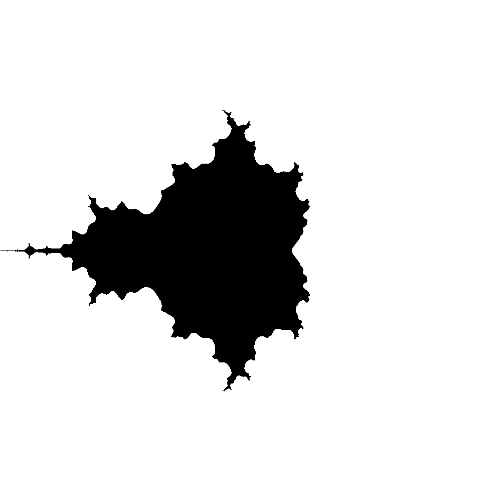
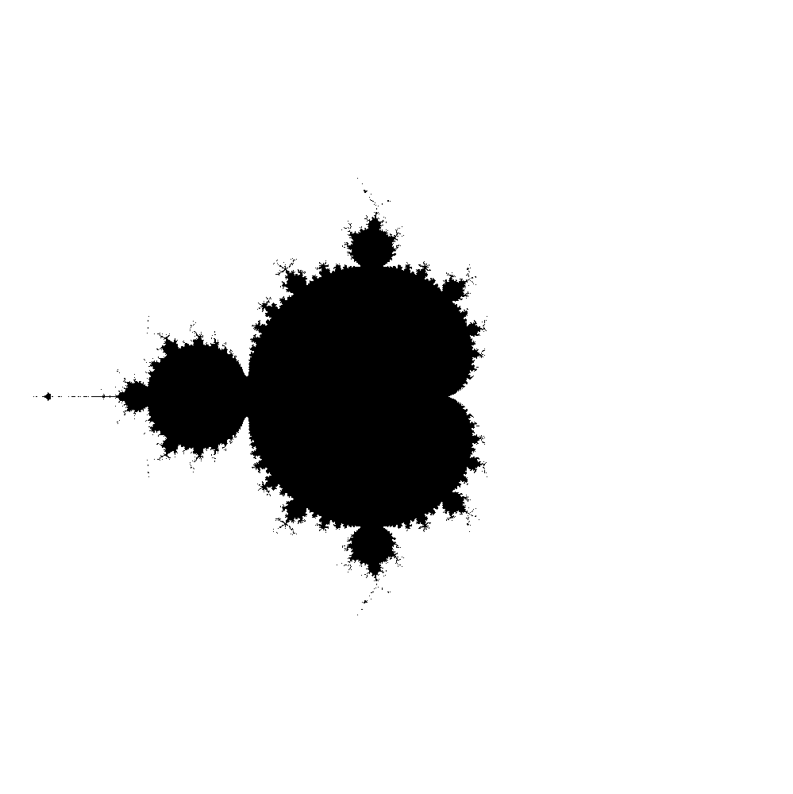

# Fractal_Mandelbrot_MIPS-ARKO

Project developed for Computer Architecture.

Program was written in assembly language for MIPS architecture (example of RISC).

In order to run :
* run `Mars4_5.jar` - MIPS simulator
* open `proj_mandelbort.asm`
* set number of iterations in console

Examples of generated Mandelbrot set (increasing number of iterations):

